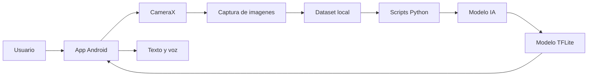

# Arquitectura del Sistema

## Vista general

SingVoiceColombia se organiza en modulos independientes para facilitar la evolucion del prototipo:

- `frontend/android`: interfaz movil, captura de imagenes, inferencia TFLite y salida por voz.
- `ai/scripts`: captura desde camara, procesamiento, entrenamiento y pruebas de inferencia.
- `ai/models`: artefactos generados por entrenamiento y reportes de evaluacion.
- `datasets`: datos locales para entrenamiento y validacion.
- `backend`: modulo reservado para servicios futuros.

## Diagrama de componentes

## Decisiones de diseno

- La aplicacion movil es el punto principal de interaccion.
- Los datasets y modelos pesados no se versionan en Git.
- Los scripts de IA son reproducibles desde la raiz del proyecto.
- La arquitectura deja espacio para integrar un backend sin bloquear el prototipo actual.
