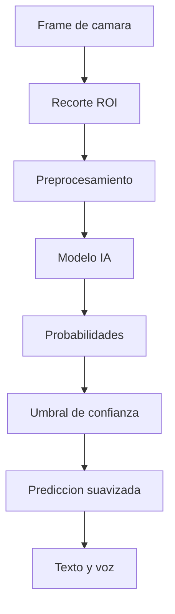

# Arquitectura del Reconocimiento de Sennas

## Pipeline



## Preprocesamiento

- Recorte central para reducir ruido.
- Redimensionamiento a tamano fijo.
- Conversion a escala de grises.
- Canal de bordes para resaltar contornos.
- Normalizacion dentro del modelo cuando aplica.

## Postprocesamiento

- Umbral de confianza para evitar predicciones debiles.
- Ventana de suavizado para reducir saltos entre clases.
- Etiquetas legibles para el usuario final.

## Integracion Android

La app carga etiquetas desde `assets/labels.txt` y modelos `.tflite` desde `assets/`. Los servicios de reconocimiento se ubican en:

```text
frontend/android/app/src/main/java/com/singvoicecolombia/datasetcapture/services/
```
